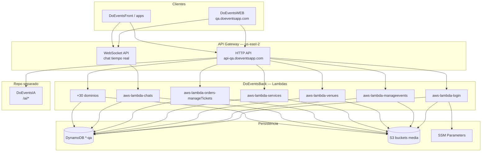
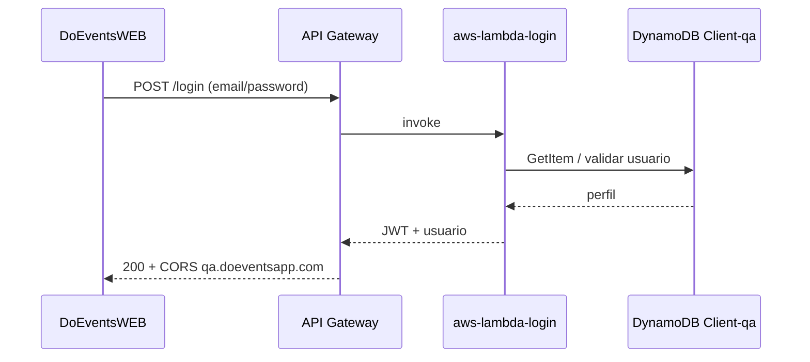

# DoEventsBack — Documentación técnica

Backend serverless de **Do.Events**: APIs REST, WebSocket, autenticación, eventos, lugares, servicios, tickets, órdenes, chat, notificaciones y backoffice. Cada dominio se despliega como **AWS Lambda** independiente con **Serverless Framework**, persistencia en **DynamoDB** y medios en **S3**.

**Repositorio:** [github.com/doeventsrepo/DoEventsBack](https://github.com/doeventsrepo/DoEventsBack) · Rama principal de trabajo: `develop`

> El asistente conversacional con IA vive en el repositorio hermano **[DoEventsIA](https://github.com/doeventsrepo/DoEventsIA)** (`/ai/*` en API Gateway). No forma parte de este repo.

---

## Tabla de contenidos

1. [Estrategia de desarrollo](#1-estrategia-de-desarrollo)
2. [Stack tecnológico](#2-stack-tecnológico)
3. [Arquitectura general](#3-arquitectura-general)
4. [Catálogo de Lambdas](#4-catálogo-de-lambdas)
5. [API Gateway y rutas](#5-api-gateway-y-rutas)
6. [DynamoDB y almacenamiento](#6-dynamodb-y-almacenamiento)
7. [Código compartido](#7-código-compartido)
8. [Estructura del repositorio](#8-estructura-del-repositorio)
9. [Entornos y configuración](#9-entornos-y-configuración)
10. [CI/CD y despliegue QA](#10-cicd-y-despliegue-qa)
11. [Desarrollo local](#11-desarrollo-local)
12. [Repositorios relacionados](#12-repositorios-relacionados)

---

## 1. Estrategia de desarrollo

### 1.1 Principios

| Principio | Descripción |
|-----------|-------------|
| **Microservicios serverless** | Un directorio `aws-lambda-*` por dominio de negocio; despliegue independiente por servicio. |
| **Node.js en Lambda** | Runtime principal `nodejs20.x` / `nodejs24.x` según lambda; dependencias por carpeta (`package.json` local). |
| **Serverless Framework** | Infra como código: `serverless.yml` (prod) y `serverless.qa.yml` (QA us-east-2). |
| **DynamoDB como fuente de verdad** | Tablas con sufijo `-qa` en entorno de pruebas; export de esquemas en `dynamodb-structure-export/`. |
| **CORS web centralizado** | Utilidad `shared/cors-web.js` para orígenes DoEventsWEB (`qa.doeventsapp.com`, localhost). |
| **IA desacoplada** | Agentes conversacionales en **DoEventsIA**; este backend expone el resto de dominios vía API Gateway. |

### 1.2 Relación con clientes

```text
DoEventsWEB / DoEventsFront / apps nativas
    → API Gateway (api-qa.doeventsapp.com)
    → Lambdas DoEventsBack (auth, eventos, venues, …)
    → DynamoDB + S3 + SES/SNS + Cognito

DoEventsWEB (asistente /assistant)
    → API Gateway /ai/*
    → DoEventsIA (repo separado)
```

---

## 2. Stack tecnológico

| Capa | Tecnología | Notas |
|------|------------|-------|
| Runtime | **Node.js** | 20.x / 24.x en Lambda |
| IaC / deploy | **Serverless Framework** | v3 en QA (buildspec); v4 en login QA |
| Compute | **AWS Lambda** | HTTP API + WebSocket |
| API | **API Gateway HTTP API** | Dominio `api-qa.doeventsapp.com` |
| Base de datos | **DynamoDB** | Región principal QA: `us-east-2` |
| Archivos | **S3** | Imágenes perfil, chat, eventos, venues |
| Auth | **JWT**, **Cognito**, OAuth | Google, Apple, Facebook en `aws-lambda-login` |
| Secretos | **SSM Parameter Store** | Ej. `JWT_SECRET` |
| CI | **GitHub Actions** | Validación `npm ci` en lambdas principales |
| Deploy QA | **AWS CodeBuild** | `buildspec-qa.yml` |

---

## 3. Arquitectura general



### Secuencia típica — login web



---

## 4. Catálogo de Lambdas

Cada carpeta `aws-lambda-*` (o `aws-lamda-*` en legado) contiene su propio `package.json`, handlers en `src/` y configuración Serverless.

| Directorio | Dominio |
|------------|---------|
| `aws-lambda-login` | Login, registro OAuth (Google/Apple/Facebook), JWT |
| `aws-lambda-generateotp` | OTP verificación |
| `aws-lambda-validateAuth` | Validación de token |
| `aws-lamda-manageusers` | CRUD usuarios, preferencias, favoritos |
| `aws-lambda-manageevents` | Creación, edición, publicación de eventos |
| `aws-lambda-managetickets` | Tipos de ticket, inventario |
| `aws-lambda-orders-manageTickets` | Órdenes y compra de tickets |
| `aws-lambda-checkouts` | Checkout / pagos |
| `aws-lambda-venues` | Lugares (fincas, salones) |
| `aws-lambda-services` | Proveedores de servicios |
| `aws-lambda-eventsFeed` | Feed social de eventos |
| `aws-lambda-chats` | Mensajería |
| `aws-global-websocket-gateway` | Gateway WebSocket chat |
| `aws-lambda-wall-social-media` | Muro / publicaciones |
| `aws-lambda-guests` | Invitados de eventos |
| `aws-lambda-notifications` | Push / notificaciones |
| `aws-lambda-imagenes` | Subida y gestión de imágenes |
| `aws-lambda-backoffice` | Panel administrativo |
| `aws-lambda-subscriptions` | Suscripciones PRO |
| `aws-lambda-staff-access` | Acceso staff / escaneo |
| `aws-lambda-ticket-scans` | Validación entradas |
| `aws-lambda-managecategories` | Categorías |
| `aws-lambda-managecomments` | Comentarios |
| `aws-lambda-EventType` / `PlaceType` | Tipologías |
| `aws-lambda-getplaces` | Búsqueda de lugares |
| `aws-lambda-GetUserTickets` | Tickets del usuario |
| `aws-lambda-auditeventlog` | Auditoría |
| `aws-lambda-Bancos` / `DatosBancarios` | Datos bancarios |
| `aws-lambda-Contactanosweb` | Formulario contacto |
| `aws-lamda-managefollows` | Seguimientos |
| `events-lifecycle-manager` | Ciclo de vida eventos (Step Functions / jobs) |

---

## 5. API Gateway y rutas

- **Base URL QA:** `https://api-qa.doeventsapp.com`
- Cada lambda registra rutas en su `serverless.qa.yml` bajo prefijos lógicos (`/login`, `/events`, `/venues`, `/services`, `/orders`, etc.).
- **CORS:** headers desde `shared/cors-web.js` — orígenes `https://qa.doeventsapp.com`, `http://localhost:5173` y variables `CORS_ALLOWED_ORIGINS`.
- **Rutas IA (`/ai/*`):** desplegadas desde **[DoEventsIA](https://github.com/doeventsrepo/DoEventsIA)**; no están en este repositorio.

---

## 6. DynamoDB y almacenamiento

### Tablas principales (QA, us-east-2)

| Tabla | Uso |
|-------|-----|
| `Client-qa` | Usuarios |
| `Eventos-qa` | Eventos |
| `Venues-qa` | Lugares |
| `ServiceProviders-qa` | Servicios / proveedores |
| `UserPreferences-qa` | Preferencias y gustos |
| `FavoriteUsers-qa` | Favoritos |
| `doevents-backoffice-qa-users` | Usuarios backoffice |

Tablas de IA (`AIAssistantSessions-qa`, `AIAgentMemory-qa`, etc.) las gestiona **DoEventsIA**.

### S3 (ejemplos QA)

| Bucket | Uso |
|--------|-----|
| `doevents-profile-media-qa` | Fotos de perfil |
| `doevent-venue-images` | Imágenes de venues (us-east-1) |

Esquemas exportados: carpeta `dynamodb-structure-export/`.

---

## 7. Código compartido

| Ruta | Propósito |
|------|-----------|
| `shared/cors-web.js` | CORS + preflight OPTIONS para clientes web |
| `scripts/` | Scripts de deploy y utilidades (`deploy-qa-subset.sh`) |

Uso en handlers:

```javascript
const { withCors, handlePreflight } = require('../../shared/cors-web');

exports.handler = async (event) => {
  const preflight = handlePreflight(event);
  if (preflight) return preflight;
  // ... lógica ...
  return withCors(event, { statusCode: 200, body: JSON.stringify(data) });
};
```

---

## 8. Estructura del repositorio

```text
DoEventsBack/
├── aws-lambda-*/          # Un servicio por dominio
├── aws-global-websocket-gateway/
├── events-lifecycle-manager/
├── shared/                  # Utilidades cross-lambda
├── scripts/                 # Deploy helpers
├── dynamodb-structure-export/
├── .github/workflows/ci.yml
├── buildspec-qa.yml         # CodeBuild QA
├── MIGRACION_WEB.md         # Notas CORS / migración web
└── README.md
```

Cada lambda típica:

```text
aws-lambda-login/
├── serverless.yml           # Producción
├── serverless.qa.yml        # QA us-east-2
├── package.json
└── src/
    └── login.js
```

---

## 9. Entornos y configuración

| Entorno | Región | Stage | API |
|---------|--------|-------|-----|
| QA | `us-east-2` | `qa` | `api-qa.doeventsapp.com` |
| Producción | según lambda | `prod` | `api.doeventsapp.com` |

Variables comunes en `serverless.qa.yml`:

- `DYNAMODB_REGION`, tablas `*-qa`
- `JWT_SECRET` vía ARN SSM
- `CORS_ALLOWED_ORIGINS` para web

**No commitear:** `.env`, claves API, `temp-key.json` ni dumps de logs (ver `.gitignore`).

---

## 10. CI/CD y despliegue QA

### GitHub Actions (`.github/workflows/ci.yml`)

En push/PR a `develop` o `main`:

1. `npm ci` en lambdas principales (`manageevents`, `login`, `managetickets`, `venues`, `checkouts`).
2. `npm audit` muestra en `login` y `manageevents`.

### CodeBuild (`buildspec-qa.yml`)

Pipeline QA actual despliega **`aws-lambda-login`** con `serverless.qa.yml`:

```bash
# Desde la raíz del repo (con credenciales AWS)
cd aws-lambda-login
npm install --omit=dev
npx serverless deploy --config serverless.qa.yml --stage qa --region us-east-2
```

Script auxiliar: `scripts/deploy-qa-subset.sh`.

Para otras lambdas, repetir el patrón en su carpeta o ampliar el buildspec.

---

## 11. Desarrollo local

```powershell
# Clonar repos hermanos (recomendado)
git clone https://github.com/doeventsrepo/DoEventsBack.git
git clone https://github.com/doeventsrepo/DoEventsWEB.git
git clone https://github.com/doeventsrepo/DoEventsIA.git

# Instalar dependencias de una lambda
cd DoEventsBack/aws-lambda-login
npm install

# Invocar handler localmente (ejemplo con serverless offline si está configurado)
# o pruebas unitarias en src/
```

Documentación de migración web y CORS: `MIGRACION_WEB.md`.

---

## 12. Repositorios relacionados

| Repositorio | Rol |
|-------------|-----|
| [DoEventsWEB](https://github.com/doeventsrepo/DoEventsWEB) | SPA React — consume estas APIs |
| [DoEventsIA](https://github.com/doeventsrepo/DoEventsIA) | Asistente IA — `/ai/chat`, agentes, Cursor API |
| DoEventsFront | App móvil Expo (legado / paralelo) |

---

*Do.Events — Backend serverless — Junio 2026*
