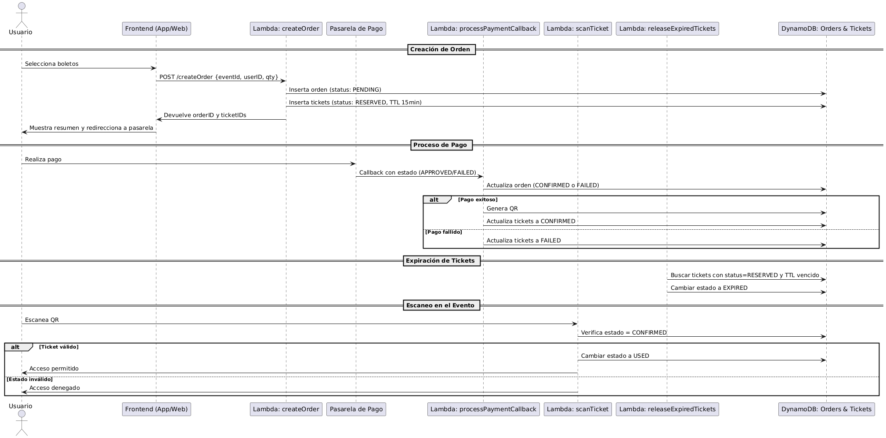

<!--
title: 'AWS Simple HTTP Endpoint example in NodeJS'
description: 'This template demonstrates how to make a simple HTTP API with Node.js running on AWS Lambda and API Gateway using the Serverless Framework.'
layout: Doc
framework: v4
platform: AWS
language: nodeJS
authorLink: 'https://github.com/serverless'
authorName: 'Serverless, Inc.'
authorAvatar: 'https://avatars1.githubusercontent.com/u/13742415?s=200&v=4'
-->

# Serverless Framework Node HTTP API on AWS

This template demonstrates how to make a simple HTTP API with Node.js running on AWS Lambda and API Gateway using the Serverless Framework.

This template does not include any kind of persistence (database). For more advanced examples, check out the [serverless/examples repository](https://github.com/serverless/examples/) which includes Typescript, Mongo, DynamoDB and other examples.

## Usage

### Deployment

In order to deploy the example, you need to run the following command:

```
serverless deploy
```

After running deploy, you should see output similar to:

```
Deploying "serverless-http-api" to stage "dev" (us-east-1)

✔ Service deployed to stack serverless-http-api-dev (91s)

endpoint: GET - https://xxxxxxxxxx.execute-api.us-east-1.amazonaws.com/
functions:
  hello: serverless-http-api-dev-hello (1.6 kB)
```

_Note_: In current form, after deployment, your API is public and can be invoked by anyone. For production deployments, you might want to configure an authorizer. For details on how to do that, refer to [HTTP API (API Gateway V2) event docs](https://www.serverless.com/framework/docs/providers/aws/events/http-api).

### Invocation

After successful deployment, you can call the created application via HTTP:

```
curl https://xxxxxxx.execute-api.us-east-1.amazonaws.com/
```

Which should result in response similar to:

```json
{ "message": "Go Serverless v4! Your function executed successfully!" }
```

### Local development

The easiest way to develop and test your function is to use the `dev` command:

```
serverless dev
```

This will start a local emulator of AWS Lambda and tunnel your requests to and from AWS Lambda, allowing you to interact with your function as if it were running in the cloud.

Now you can invoke the function as before, but this time the function will be executed locally. Now you can develop your function locally, invoke it, and see the results immediately without having to re-deploy.

When you are done developing, don't forget to run `serverless deploy` to deploy the function to the cloud.


ORDERS PLANT UML

@startuml
actor Usuario
participant "Frontend (App/Web)" as Frontend
participant "Lambda: createOrder" as CreateOrder
participant "Pasarela de Pago" as PaymentGateway
participant "Lambda: processPaymentCallback" as ProcessCallback
participant "Lambda: scanTicket" as ScanTicket
participant "Lambda: releaseExpiredTickets" as ExpireTickets
participant "DynamoDB: Orders & Tickets" as DB

== Creación de Orden ==
Usuario -> Frontend : Selecciona boletos
Frontend -> CreateOrder : POST /createOrder {eventId, userID, qty}
CreateOrder -> DB : Inserta orden (status: PENDING)
CreateOrder -> DB : Inserta tickets (status: RESERVED, TTL 15min)
CreateOrder -> Frontend : Devuelve orderID y ticketIDs
Frontend -> Usuario : Muestra resumen y redirecciona a pasarela

== Proceso de Pago ==
Usuario -> PaymentGateway : Realiza pago
PaymentGateway -> ProcessCallback : Callback con estado (APPROVED/FAILED)
ProcessCallback -> DB : Actualiza orden (CONFIRMED o FAILED)
alt Pago exitoso
    ProcessCallback -> DB : Genera QR
    ProcessCallback -> DB : Actualiza tickets a CONFIRMED
else Pago fallido
    ProcessCallback -> DB : Actualiza tickets a FAILED
end

== Expiración de Tickets ==
ExpireTickets -> DB : Buscar tickets con status=RESERVED y TTL vencido
ExpireTickets -> DB : Cambiar estado a EXPIRED

== Escaneo en el Evento ==
Usuario -> ScanTicket : Escanea QR
ScanTicket -> DB : Verifica estado = CONFIRMED
alt Ticket válido
    ScanTicket -> DB : Cambiar estado a USED
    ScanTicket -> Usuario : Acceso permitido
else Estado inválido
    ScanTicket -> Usuario : Acceso denegado
end
@enduml



//www.plantuml.com/plantuml/png/bLH1Rjim4Bph5OiSYWH84VJGYm4NiIqb4934gksalQwfJK148bMISkCMVKpVq2VaOrrGecm6JeFwO5YhcTdbxD3drg5nRLqbA9msS6jRD58d3LUba0qg1qSNHYj7geJZITESVQ7roH6WXL2EmLTOhqiSWJ24ZkQc9EFHizrpJ2ZGeg4AeIGey45xT87RcfIxPCftt1xkq1WjoDeUEiEgMgDuxEZTgr0xpBS2rKgAHtAUinmU3yDvHa9BsLCZ3PKTqdfcL-ehCJdTAgnrEXs1Fxc5Tx3FJAT9CXvxRuHy_gFO0mzKC1ud_IxW_QV1QXZ1aiSGGcg5iDOLEMsJy9QH-pOpk9WlLt0czce_QSDcvUKfj9PCdfx2DxVzbUpJM2MTCZbNZ708sWzqR1swrh9cTfFcDvSd_-Iuxf0xrY9RPekxZFkjLbVmuMCjLQmGdpAbJKlLXdnp7XEslMIUnkVjJMBATKlM6GH3jkL0C8FN94qm2w7fW-OjxnAYG-XYlr_43tXymah-O0t69l5RZu_pneJXfz0AU30iDL-VebZCsOIpYqb-bQKdoKjUi74YNEiR1lDdyvkBV76TfQ0XaB5otUpq99ssEW7-lAPuIOeCmkU5HxtTDomGOMYTK6Lxj-wPA4lztrhTw0dlpY_1NvnTybSzZdSHNQb1SjfQWIReUMkxV8r3l63hyyKP5ppVAp8plj4IJLWBGlQro1TPsit4BHHf80LKGSPAxcKwTlyKCEhntjbTVMXrHqRUIu6XrtXdfzzV3zyy_nxyZ5KE3toxP7uCZY_3HFXqDsHgwLYvsrtMyQKQ-hqjmV6Z1sRvfPtpLrjNVm40